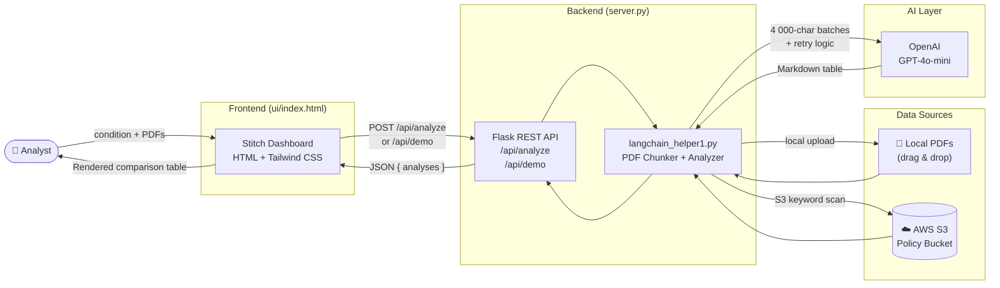
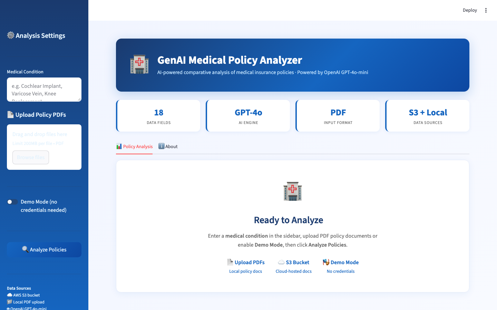
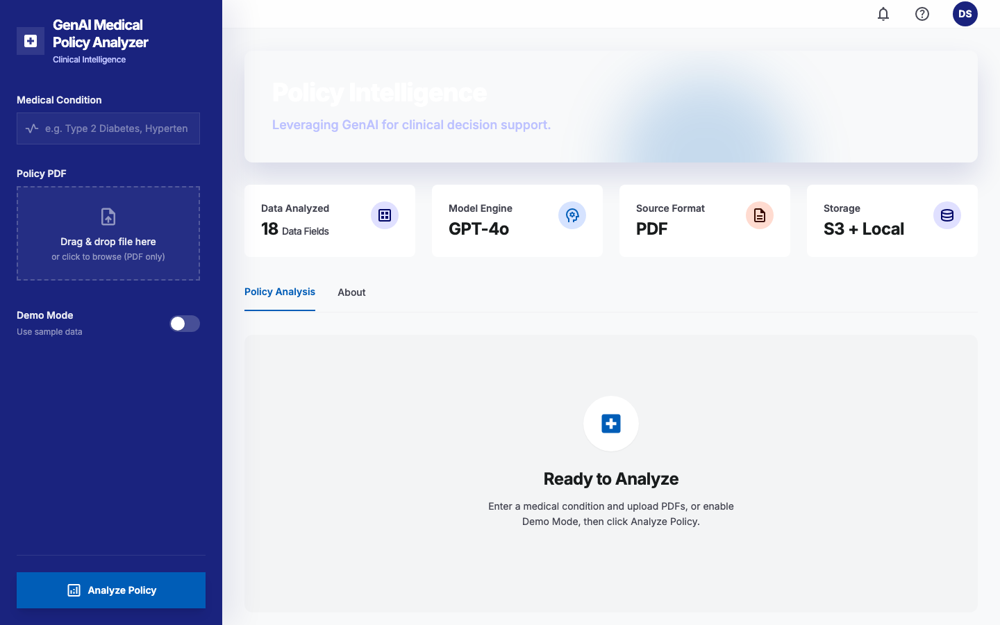
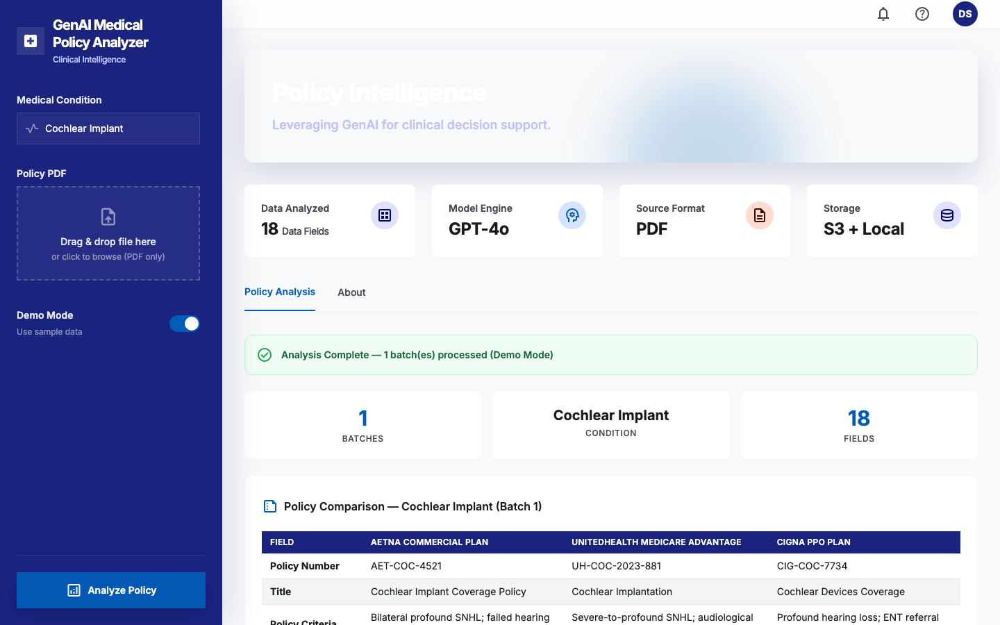
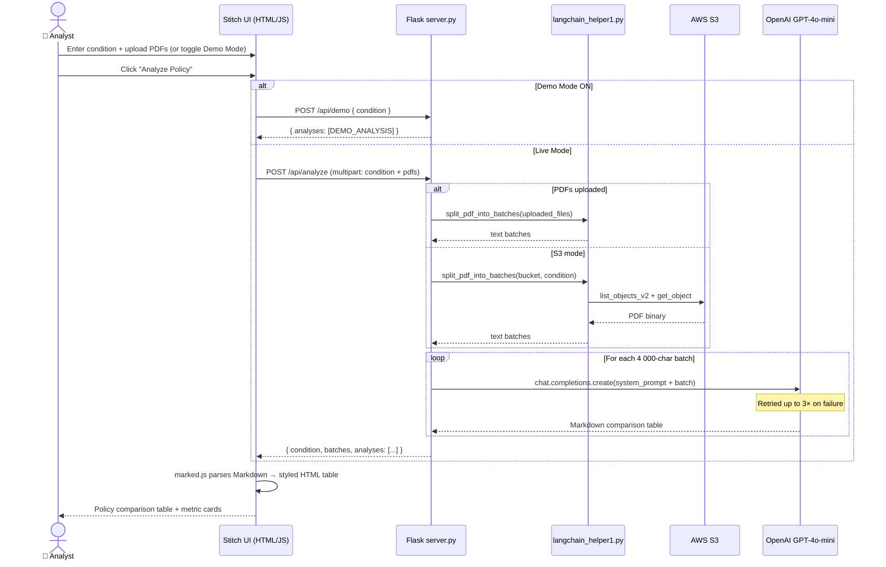
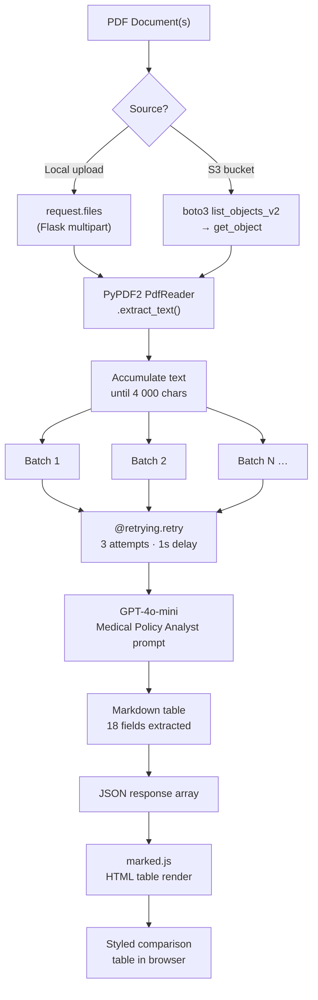
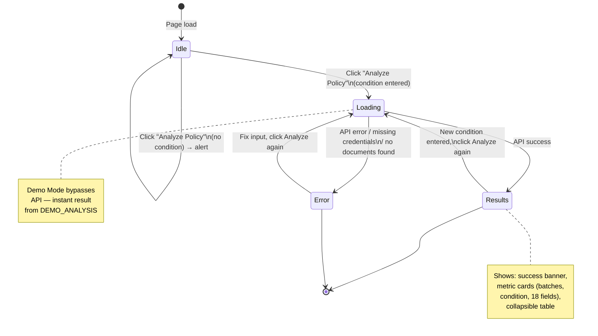

 

# GenAI Medical Policy Analyzer

> AI-powered document intelligence for healthcare payer organizations — automatically extracts, structures, and compares critical data fields from medical insurance policy PDFs across multiple insurers using OpenAI GPT-4o-mini.

---

## What This Project Does

Medical insurance policies are dense, inconsistent legal documents — each insurer formats them differently, uses different terminology, and buries critical coverage details across dozens of pages. For healthcare payer analysts, manually comparing policies across Aetna, UnitedHealth, Cigna, and other providers is a time-consuming, error-prone process.

This tool solves that by:

1. **Ingesting** policy PDF documents from local upload or AWS S3
2. **Chunking** the text into manageable batches to fit within LLM context limits
3. **Prompting** OpenAI GPT-4o-mini with a structured medical policy analyst system prompt that extracts 18 predefined fields
4. **Rendering** the output as a side-by-side comparison table, making differences across insurers immediately visible

The result: what previously took hours of manual review is reduced to a single click.

### System Architecture



---

## UI/UX Transition: Streamlit → Google Stitch

The UI was redesigned using **Google Stitch** — an AI-powered UI generation tool — replacing the original Streamlit prototype with a production-grade healthcare SaaS dashboard built in HTML/Tailwind CSS, served by a Flask REST backend.

### Before — Streamlit UI


The original prototype used Streamlit's built-in components: sidebar for inputs, `st.markdown()` for results, and `st.spinner()` for loading states. Functional, but constrained by Streamlit's default styling and layout system.

### After — Google Stitch UI




The new interface was generated by Google Stitch with a custom healthcare design system (`#1A237E` navy primary, Inter + IBM Plex Sans typography, Material Symbols icons, Tailwind CSS utility classes) and then wired up with JavaScript to call the Flask API.

**Key improvements in the redesign:**

| Aspect | Streamlit (Before) | Google Stitch + Flask (After) |
|---|---|---|
| Layout engine | Streamlit grid system | Tailwind CSS flexbox/grid |
| Sidebar | Streamlit `st.sidebar` | Custom dark navy HTML aside |
| Color scheme | Streamlit default blue | `#1A237E` / `#1565c0` healthcare brand |
| File upload | `st.file_uploader` | Drag-and-drop zone with file counter |
| Results display | `st.markdown()` rendered | Interactive `<details>` with styled table |
| Demo mode | `st.toggle` | JavaScript toggle with real-time switch |
| API | None (single-process) | Flask REST: `/api/analyze`, `/api/demo` |
| Deployability | Streamlit Cloud only | Any WSGI host (Gunicorn, Docker, AWS) |

---

## How It Works

### Request / Response Flow



### Batch Processing Pipeline



### Batch Processing

PDFs are split into 4000-character text batches before being sent to GPT. This is necessary because:
- Medical policy documents often exceed 50+ pages
- LLM context windows have token limits
- Chunking allows the model to focus on one section at a time and avoids truncation

Each batch is analyzed independently and the results are displayed in collapsible sections.

### Demo Mode

When no credentials are configured, Demo Mode returns a pre-built Cochlear Implant policy comparison across Aetna Commercial, UnitedHealth Medicare Advantage, and Cigna PPO — populated with realistic sample data. This lets new users explore the full UI without needing an OpenAI key or AWS bucket.

---

## Extracted Fields (18 Total)

| # | Field | Description |
|---|---|---|
| 1 | Policy Number | Unique identifier for the policy |
| 2 | Title | Official policy document title |
| 3 | Policy Criteria | Key conditions/prerequisites for coverage |
| 4 | Age Criteria | Age-related requirements (e.g., "12 months+") |
| 5 | Insurance Company | Name of the insurer |
| 6 | Insurance Type | Commercial / Medicaid / Medicare Advantage |
| 7 | Service Type | Medical / Pharmacy / Specialty Drug |
| 8 | Status | Active / Archived / Future |
| 9 | Effective Date | Date the policy took effect |
| 10 | Last Review | Most recent policy review date |
| 11 | Next Review | Scheduled next review date |
| 12 | Guideline Source | Clinical guidelines cited (AAO-HNS, CMS, etc.) |
| 13 | States Covered | Geographic coverage |
| 14 | Prior Authorization | Whether prior auth is required (Yes/No) |
| 15 | Exclusions/Limitations | What is explicitly not covered |
| 16 | Coverage Period | Start and end dates of coverage |
| 17 | Related Policies | Linked or cross-referenced policies |
| 18 | Link to Policy | Reference to the source PDF document |

Fields not found in a document are marked "Not specified" rather than left blank, making gaps in coverage immediately identifiable.

---

## UI State Machine



---

## Features

- **Multi-source PDF ingestion** — local drag-and-drop upload or AWS S3 bucket scan by condition keyword
- **18-field structured extraction** — consistent schema applied across all policies regardless of insurer formatting
- **Side-by-side comparison table** — markdown rendered into a styled HTML table with alternating row shading
- **Batch processing with retry logic** — `@retrying.retry` decorator handles transient OpenAI API errors (3 attempts, 1s delay)
- **Demo Mode** — full UI exploration with no credentials required
- **REST API** — Flask backend decoupled from the frontend; can be consumed by other tools
- **Responsive design** — Tailwind CSS grid adapts from 1 to 4 columns

---

## Tech Stack

| Layer | Technology |
|---|---|
| UI / Design | Google Stitch + HTML / Tailwind CSS / Material Symbols |
| UI Framework (legacy) | Streamlit (`main_streamlit.py`) |
| Backend | Python 3.11 / Flask 3.x |
| AI Engine | OpenAI GPT-4o-mini |
| PDF Parsing | PyPDF2 3.x |
| Cloud Storage | AWS S3 via boto3 |
| Retry Logic | `retrying` library |
| Config | python-dotenv |

---

## Project Structure

```
GenAI-Medical-Policy-Analysis/
├── server.py              # Flask server — primary entry point
├── langchain_helper1.py   # Core backend: PDF chunking + OpenAI analysis
├── app.py                 # Alternative S3-only Streamlit analyzer
├── readfile.py            # S3 PDF reader utility
├── readfile2.py           # S3 PDF reader with analysis (standalone)
├── main_streamlit.py      # Legacy Streamlit UI (archived for reference)
├── requirements.txt
├── .env.example           # Credential template
├── .gitignore
└── ui/
    ├── index.html         # Stitch-generated dashboard (primary UI)
    ├── results.html       # Stitch-generated results screen design
    └── screenshots/
        ├── streamlit_before.png       # Before: Streamlit UI
        ├── stitch_live_dashboard.png  # After: Stitch dashboard (live)
        ├── stitch_live_results.png    # After: Stitch results (live)
        ├── stitch_dashboard.png       # Stitch design mockup
        └── stitch_results.png         # Stitch results mockup
```

---

## Setup

### Prerequisites

- Python 3.9+
- OpenAI API key (for live analysis)
- AWS credentials (only if using S3 bucket; not needed for local PDF upload or Demo Mode)

### Installation

```bash
git clone https://github.com/atharvadevne123/GenAI-Medical-Policy-Analysis
cd GenAI-Medical-Policy-Analysis

# Create virtual environment
python3 -m venv venv
source venv/bin/activate        # Windows: venv\Scripts\activate

# Install dependencies
pip install -r requirements.txt

# Configure credentials
cp .env.example .env
```

Edit `.env`:
```
OPENAI_API_KEY=sk-...
AWS_ACCESS_KEY_ID=AKIA...          # optional — only needed for S3 mode
AWS_SECRET_ACCESS_KEY=...          # optional — only needed for S3 mode
```

### Run

```bash
python server.py
# → http://localhost:5000
```

To use the legacy Streamlit UI:
```bash
streamlit run main_streamlit.py
# → http://localhost:8501
```

---

## API Reference

| Method | Endpoint | Description |
|---|---|---|
| `GET` | `/` | Serves the Stitch dashboard UI |
| `POST` | `/api/analyze` | Analyze uploaded PDFs or S3 bucket |
| `POST` | `/api/demo` | Return sample data (no credentials needed) |

**POST `/api/analyze`** — `multipart/form-data`
```
condition  string   required   Medical condition keyword (e.g. "Cochlear Implant")
pdfs       file[]   optional   One or more PDF files; falls back to S3 if omitted
```

**POST `/api/demo`** — `application/json`
```json
{ "condition": "Cochlear Implant" }
```

**Response (both endpoints)**
```json
{
  "condition": "Cochlear Implant",
  "batches": 1,
  "analyses": ["| Field | Aetna | ..."],
  "demo": true
}
```

---

## Use Cases

- **Healthcare payer organizations** — automate the manual process of reviewing competitor or internal policy documents
- **Medical billing teams** — quickly identify prior authorization requirements and exclusions before submitting claims
- **Health plan compliance teams** — track policy effective dates, review cycles, and states covered across a portfolio
- **Healthcare IT / AI teams** — reference implementation for document intelligence pipelines using GPT + PyPDF2 + Flask

---

## Author

**Atharva Devne**